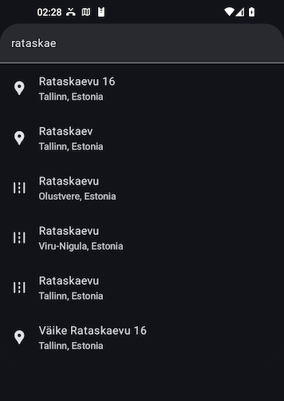

# Stadia Maps Autocomplete Search for Jetpack Compose

[](https://central.sonatype.com/artifact/com.stadiamaps/jetpack-compose-autocomplete)

This package helps you easily add geographic autocomplete search to your Android apps.

* Displays a search box and list which you can embed in other views 
* Provides a callback handler with the result details when users tap a result 
* Can bias search results to be nearby a specific location 
* Automatically localizes place names based on the user's device settings (where available)



## Getting Started

First, add the library to your project using your preferred build system.

Gradle (Groovy):

```groovy
implementation 'com.stadiamaps:jetpack-compose-autocomplete:2.0.0'
```

Gradle (Kotlin):

```kotlin
implementation("com.stadiamaps:jetpack-compose-autocomplete:2.0.0")
```

You can find more examples on [Maven Central](https://central.sonatype.com/artifact/com.stadiamaps/jetpack-compose-autocomplete).

## Getting an API key

You will need an API key to use this composable.

You can create an API key for free
[here](https://client.stadiamaps.com/signup/?utm_source=github&utm_campaign=sdk_readme&utm_content=jetpack_compose_autocomplete_readme)
(no credit card required).

Note that while autocomplete search is available on the free tier,
deep search (on submit) with support for advanced features like missing address interpolation
is only available with a paid subscription.

## Using the Composable

```kotlin
AutocompleteSearch(
  // Replace with your API key; see the demo project for one example of API key embedding
  apiKey = BuildConfig.stadiaApiKey,
  // Optional parameter to bias the location and show distances in results.
  // This snippet assumes that you have a location property in your view model or similar context.
  userLocation = lastLocation.value?.toAndroidLocation()) { feature ->
    // Do something with the selection.
    // For example, you might do something like this to start navigation
    // in an app using Ferrostar (https://docs.stadiamaps.com/sdks/ferrostar).
    // Fetch a route in the background
    feature.center()?.let { center ->
      // Fetch a route in the background
      scope.launch(Dispatchers.IO) {
        // TODO: Fail gracefully
        val routes =
          AppModule.ferrostarCore.getRoutes(
            loc,
            listOf(
              Waypoint(
                coordinate = GeographicCoordinate(center.latitude, center.longitude),
                kind = WaypointKind.BREAK
              ),
            )
          )

        val route = routes.first()
        viewModel = AppModule.ferrostarCore.startNavigation(route = route)
      }
    }
}
```

## Customizing the result views

Don't like the built-in search result view?
You can replace the list items with your own composable!

```kotlin
AutocompleteSearch(
  modifier = Modifier.padding(innerPadding),
  apiKey = apiKey,
  resultView = { feature, modifier ->
    // NB: Be sure to set the modifier! If you forget this, you won't have a click handler!
    Row(modifier = modifier) {
      Text("📍 ${feature.properties?.name ?: "<No Name>"}")
    }
  }
) {
  // TODO: Your selection logic here
}
```

## Demo App

Set an API key in local.properties to run the demo app:

```properties
stadiaApiKey=YOUR-API-KEY
```
